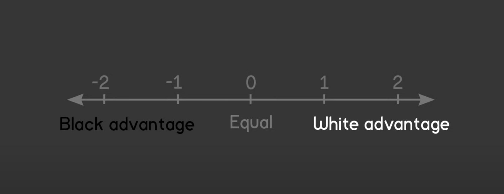

# How to calculate profitability of the next move

Resources:

- [pleco](https://docs.rs/pleco/0.5.0/pleco/)
- [Board](https://docs.rs/pleco/0.5.0/pleco/board/struct.Board.html)
- [bitboard-representation](https://docs.rs/pleco/latest/pleco/board/struct.Board.html#bitboard-representation)
- [eval_low](https://docs.rs/pleco/0.5.0/pleco/tools/eval/struct.Eval.html#method.eval_low)
- [best_move](https://docs.rs/pleco/latest/pleco/tools/trait.Searcher.html#tymethod.best_move)
- [Algorithms Explained – minimax and alpha-beta pruning](https://youtu.be/l-hh51ncgDI)

The value can be calculated in the following way:

- Make desired move
- Calculate board score
- Undo your last move
- Find best move and make it
- Calculate board score
- Undo your last move
- Calculate the profit value

The board score value:

